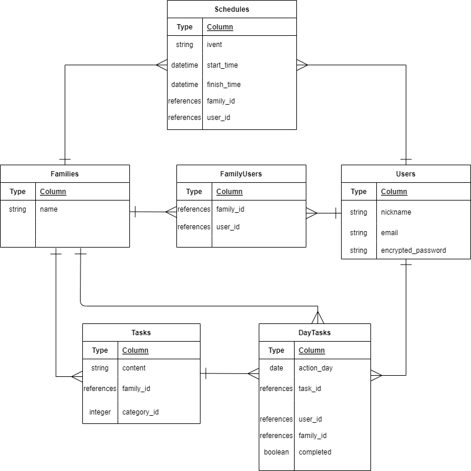
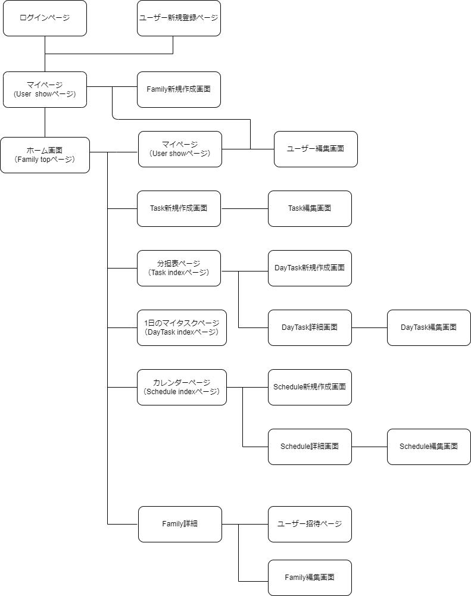

# アプリケーション名
CHESK

# アプリケーション概要
家族でタスクを共有し管理することで、家事や育児、介護などを1人に負担が集中することなく家族で協力してスムーズに行えるようにすることができる。

# URL
https://chesk.onrender.com

# テスト用アカウント
- Basic認証ID：admin
- Basic認証パスワード： 0306
- メールアドレス： test@test.jp
- パスワード： test0325

# 利用方法
## ユーザー管理機能
１．トップページのヘッダーから「登録する」ボタンをクリックすると、新規登録画面へと遷移できる。ニックネームやメールアドレス、パスワードを入力し登録ボタンをクリックすると新規登録できる。
２．ログイン後、トップページであるマイページから、登録内容を確認でき、「登録内容を変更」ボタンをクリックすると、ニックネームやメールアドレス、パスワードの変更を行える。
３．マイページから、「退会」ボタンをクリックすると、ユーザーが持つすべての情報を削除しアプリから退会することができる。
４．ヘッダーのログアウトボタンをクリックすると、アプリからログアウトできる。
５．ログインしていない場合にアプリへとアクセスすると、ログイン画面へと遷移する。メールアドレスとパスワードを入力するとログインすることができる。
６．パスワードを忘れてしまった場合、ログイン画面から「パスワードを忘れた方はこちらへ」の「こちら」をクリックすると、パスワードの再設定を行えるようになる。

## ファミリー管理機能
１．ログイン後、マイページからファミリー作成ボタンをクリックし、ファミリー名を入力後、作成する。
２．マイページに戻り、ファミリー名を選択すると、そのファミリーのホーム画面へと遷移できる。
３．メンバーを追加する場合、ホーム画面から、ファミリー詳細ページへ遷移し、メンバを招待するボタンをクリックする。
４．アプリ未登録の場合、メールアドレスとニックネーム、招待先のファミリー名を選択・入力し、招待をする。すでにアプリを利用しているユーザーの場合、メールアドレスと招待先ファミリー名を選択・入力することで招待できる。
５.アプリ未登録者の場合、メールよりURLをクリックすることでニックネームやパスワードを設定し、ファミリーに参加することができる。
すでにアプリを利用しているユーザーの場合、ログインすると所属ファミリーファミリー一覧からファミリーのホーム画面へと遷移できるようになる。

６．各ファミリーのホームから、ファミリー詳細ページにて、ファミリー名の編集やファミリーの削除ができる。
７．トップページであるマイページから、ファミリー名横のアイコンをクリックすると、ファミリーから退会することができる。

## タスク管理機能
１．各ファミリーのホームから「タスク管理」ボタンをクリックするとタスクの一覧表示や新規作成ができる。
２．タスクの新規作成は、カテゴリーの選択とタスク内容を入力後「作成する」ボタンをクリックすると作成できる。
３．タスクの一覧から、各タスクの編集アイコンをクリックすると、タスク編集画面へと遷移し、タスク内容やカテゴリーの編集ができる。
４．タスク一覧から、各タスクの削除アイコンをクリックすると、タスクを削除することができる。

## １日のタスク管理機能
１．各ファミリーのホームまたは画面下のナビバーから、「分担表」ボタンをクリックすると、１週間分の
タスク分担表を閲覧できる。
２．分担表の右下の＋ボタンをクリックすると、タスクの振り分けを設定できる画面へと遷移できる。
３．実行日、タスク内容、担当者を入力後「設定する」ボタンをクリックすると、タスクの振り分けを設定できる。
４．振り分けしたものは、分担表で実行日に応じて表示される。分担表の各タスクをクリックすると、振り分けたタスクの詳細を見ることができる。
５，タスク詳細画面から、「変更」ボタンをクリックすると、振り分け内容の編集画面へと遷移し、「変更する」ボタンをクリックすると編集できる。
６．タスク詳細画面から、削除ボタンをクリックすると、削除できる。
７．ホームまたは画面下のナビバーから、「マイタスク」ボタンをクリックすると、ログインユーザーの一日のタスクを確認できる。
８．タスクを完了後、マイタスク画面で、完了したタスクにチェックを入れると、そのタスクは完了状態になり、分担表で完了マークがつく。

## スケジュール管理機能
１．各ファミリーのホームまたは画面下のナビバーから、「カレンダー」ボタンをクリックすると、月間カレンダーを表示できる。
２．カレンダー画面から、右上の「予定を追加する」ボタンをクリックすると行事などの予定を作成することができる画面へと遷移できる。
３．予定の追加画面で、誰の予定なのかや予定内容、予定開始時刻、予定終了時刻を入力し、「登録する」ボタンをクリックすると、予定を登録することができる。
４．追加した予定はカレンダーに反映され、家族の予定を把握することができる。
５．カレンダーの各予定をクリックすると、その予定の詳細を確認できる。詳細画面から「変更」ボタンをクリックすると、編集画面へと遷移し、予定内容の変更ができる。
６．詳細画面から「削除」ボタンをクリックすると予定を削除することができる。
７．タブレットやスマートフォンサイズで利用している場合、月間カレンダーの下に週間カレンダーも表示される。そのため、週間カレンダーに表示されている各予定の左にあるアイコンをクリックしても、詳細画面へと遷移できる。

# アプリケーションを作成した背景
自分自身が、前職で家庭と仕事の両立に対して難しさを感じていたため、家族と家事を共有して管理できるようなアプリを作成したいと考えました。家事のみに関わらず、育児や介護に関して同じような悩みを抱える方は多いのではないかと思い、複数のファミリーを使い分けることで、家族と分担しやすくするアプリケーションを開発することにしました。

# 洗い出した要件
要件定義シート
https://docs.google.com/spreadsheets/d/172GIjkHzgXA4Q6JrC_LfvxmtmP2cnB08AI7ELuAE05M/edit?usp=sharing

# 実装予定の機能
現在、コメント機能の実装を検討中。
また、カレンダーに祝日の設定を行いたいと考えている。

# データベース設計
## Familiesテーブル
| column | Type   | Options     |
|--------|--------|-------------|
| name   | string | null: false |

### Association
- has_many :users, through: :family_users
- has_many :tasks
- has_many :schedules
- has_many :day_tasks

## Usersテーブル
| column             | Type   | Options                    |
|--------------------|--------|----------------------------|
| nickname           | string | null: false                |
| email              | string | null: false, unique: true  |
| encrypted_password | string | null: false                |

### Association
- has_many :families, through: :family_users
- has_many :day_tasks
- has_many :schedules

## FamilyUsersテーブル
| column    | Type       | Options                        |
|-----------|------------|--------------------------------|
| family_id | references | null: false, foreign_key: true |
| user_id   | references | null: false, foreign_key: true |

## Association
- belongs_to :family
- belongs_to :user

## Tasksテーブル
| column      | Type       | Options                        |
|-------------|------------|--------------------------------|
| content     | string     | null: false                    |
| category_id | integer    | null: false                    |
| family_id   | references | null: false, foreign_key: true |

### Association
- belongs_to :family
- has_many :day_tasks

## DayTasksテーブル
| column      | Type       | Options                        |
|-------------|------------|--------------------------------|
| start_time  | date       | null: false                    |
| task_id     | references | null: false, foreign_key: true |
| user_id     | references | null: false, foreign_key: true |
| family_id   | references | null: false, foreign_key: true |
| completed   | boolean    | null: false, default: false    |

### Association
- belongs_to :task
- belongs_to :user
- belongs_to :family

## Schedulesテーブル
| column      | Type       | Options                        |
|-------------|------------|--------------------------------|
| event       | string     | null: false                    |
| start_time  | datetime   | null: false                    |
| end_time    | datetime   | null: false                    |
| family_id   | references | null: false, foreign_key: true |
| user_id     | references | null: false, foreign_key: true |

### Assosiation
- belongs_to :family
- belongs_to :user

# 画面遷移図

# 開発環境
- フロントエンド
HTML、CSS、bootstrap
- バックエンド
Ruby on Rails、MySQL
- インフラ
Render、PostgreSQL
- テキストエディタ
Visual Studio Code

# 工夫したポイント
多くのユーザーはスマホでの使用のため、スマホでも見やすくするなどレスポンシブ対応にこだわって作成した。
また、ユーザーが使いやすくするため、家族のタスク管理とスケジュール、どちらも共有できる仕様にした。